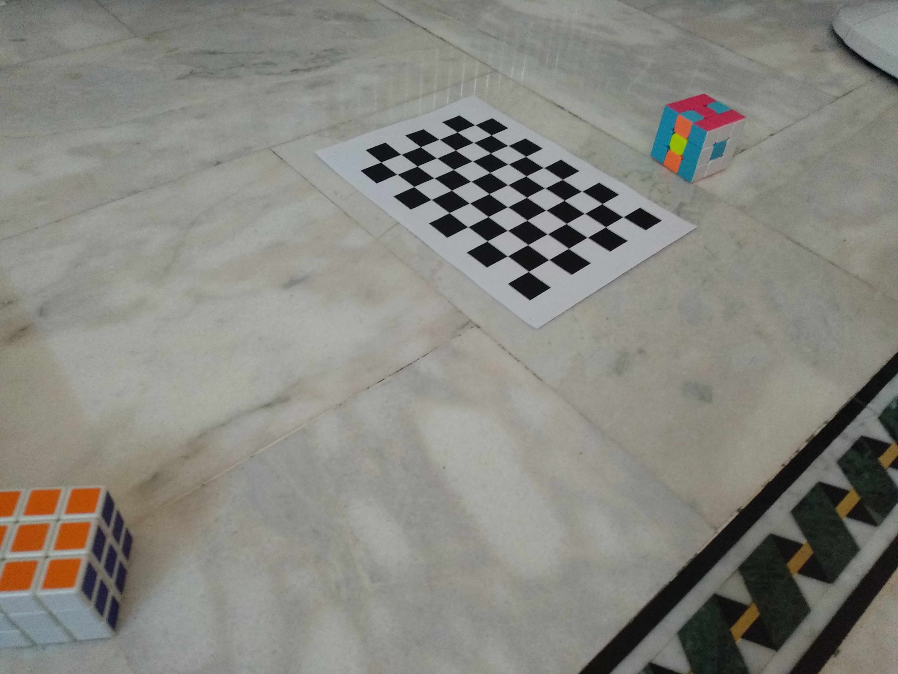

# Camera-Calibration

The goal is to find the intrinsic and extrinsic parameters on
camera on Xiaomi Mi A1 mobile phone. before getting started I disabled autofocus mode of the camera.
I made 31 photos of chessboard.

The size of square on the chessboard I used is 15 mm. The key is that we will know each square size and we will assume each square is equal. It means, that now we know the coordinates of each point on the chess plane. After that we can use the formulas to define intrinsic and extrinsic parameters

### Calibration code

The chessboard is a 9x6 matrix so we set our width=9 and height=6. These numbers are the intersection points square corners met. “Criteria” is our computation criteria to iterate calibration function. 

objpoints is the map we use for the chessboard. imgpoints is a matrix that holds chessboard corners in the 3D world. These coordinates are coming from the pictures we have taken.

We have a for loop to iterate over the images. cv2.imread gets the image and cv2.cvtColor changes it to grayscale. cv2.findChessboardCorners gets the points and we already have the points.

If the function returns successfully we can start to interpolate. 
The last step, use calibrateCamera function and read the parameters then we save the camera matrix to a yml file.

### Estimating the height and width of the Rubik's Cube

Now since we have calibrated our camera, and stored intrinsic and extrinsic parameters. I took a photo of a rubik's cube using the calibrated camera, and we want to estimate the height and width of the selected object using both a ruler and an image from the calibrated camera. 

Now we need to find the corners coordinates of rubik's cube

To do that we need to either do some image processing or to hardcoded corners into an array by cheating the points from the image. Well I chose the long way for the sake of having some fun

I tried to use different color spaces (RGB, HSV, YUV, and LAB) and I found LAB is a good choice in our case

### Undistort the Image

Use the cameraParameters object to remove lens distortion from the image. This is necessary for accurate measurement.

Just to make the problem easier temporarily we will eliminate the padding area

We see that a* layer (a*: Red/Green Value) of Lab image gives us good result

To find the contour of the object we will use the closing morphological transform

**Duh! why we still have a gray scale image let's convert it to binary image to make our calculations faster and even having better results**

Let's use cv2.goodFeaturesToTrack to get corners of the object and we need to calculate the new chessboard corners, then let's visualize the corners to check the quality of result

Well that's not bad, I think it's enough for now since we have the ability to calculate the sides of the rubik's cube and block size of chessboard

To calculate the block size of chessboard we could sort the corners by euclidean distance and calculate the difference between them over the unmatched axis

For the cube we will calculate two sides of it (they should be almost equal to each other)

Rubik's cube dimensions using ruler are 5.5 cm for each side  and the result we got is 3.78 cm by 3.54 cm

### If you like what I do and you want to support me:

Bitcoin address: 
<mark>`bc1q5cjffml32qrvks3xd0hyau8jx3gf5cd04hrn77`</mark>

Litecoin address: 
<mark>`ltc1q9l4dr8jdtcakhe8qekep9lfwpgscpllxv5zy27`</mark>

Tether address: 
<mark>`0x0006a16f43D0fdf480bCc88D4398Fe73D6806fc9`</mark>
